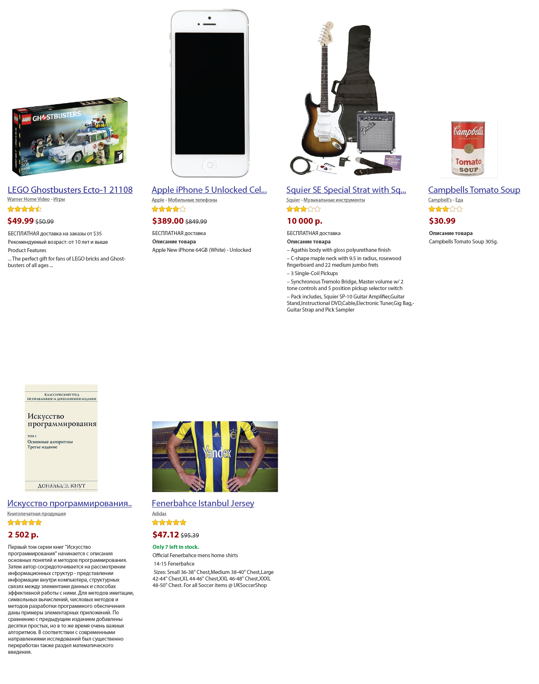
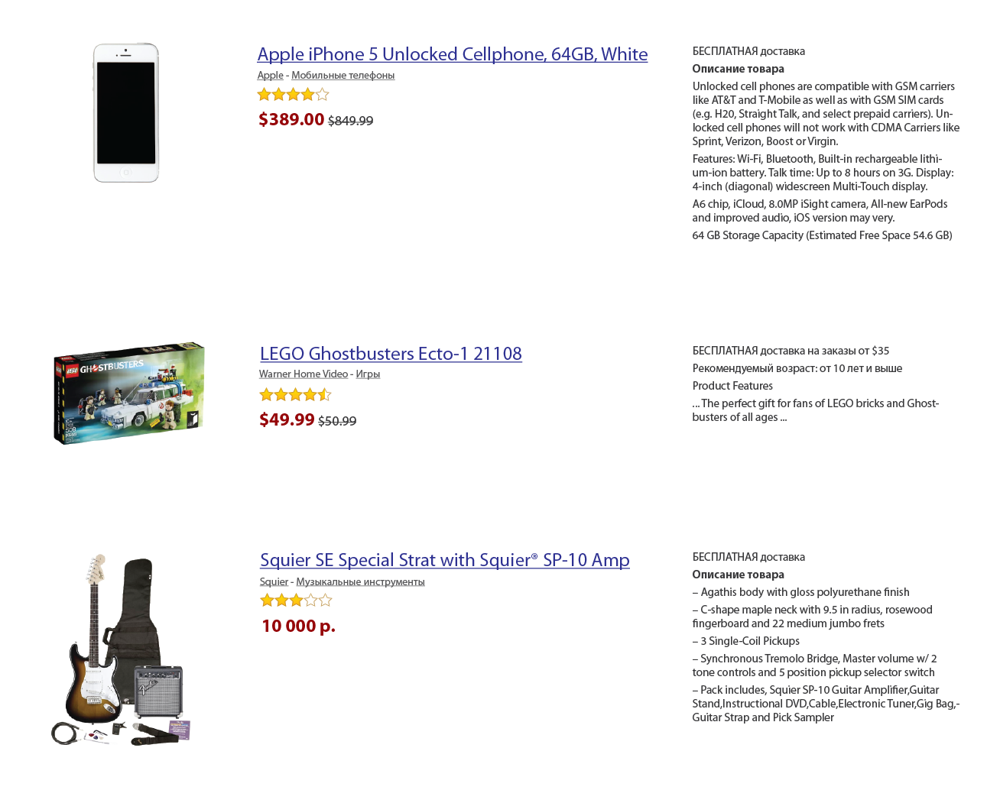

# Мяндекс.Муррркет

## Основное задание

 ⚠️ Задание необходимо решить без использования JS и flex/grid (если вы знаете, что это).

У моей бабуленьки очень много котиков (=^･ｪ･^=), обычно она как-то «справлялась» с этим, но потом доброта взяла верх:
она подошла к внучку с просьбой помочь. И так как «яжпрограммист», я предложил ей запустить интернет-магазин добрых котиков.

Название-то нашлось сразу — «Мяндекс.Муррркет». А вот с версткой проблемы, да и дизайнера нет. Макеты дизайна я решил
взять с одного известного магазина (картинки кликабельны).

На среднем экране:

На большом:

Эти макеты демонстрируют поведение блоков-карточек котиков. При растягивании экрана количество вмещаемых в строку
котиков увеличивается, при уменьшении — уменьшается.

Плюс возможность посмотреть в виде списка:

Будет любезно с вашей стороны помочь бабуленьке сверстать магазинчик по этим макетам. Только не забывайте, что магазин
о котиках (=｀ω´=), а значит нужно найти картинки с котиками и информацию о них (не меньше 10 котиков).

Карточка должна содержать фото и некоторую информацию о котике:

- имя котика (ссылка)
- категория котика (понятия не имеем, что это)
- уровень доброты котика по 5-балльной шкале (как звездочки на макетах)
- стоимость котика (и старая стоимость, если она есть)
- описание котика

От вас также требуется:

- обрезать длинные имена котиков с помощью CSS (=^ ◡ ^=)
- реализовать переключатель вывода котиков: плитками или списком
- Реализовать эффект при наведении на имя или на картинку:
  - Имя окрашивается в красный цвет
  - Картинка приобретает уровень прозрачности 0.7

Внимательные верстальщики заметили, что в макете используется интересное выравнивание по нижней линии фото котика <(￣︶￣)> .
То есть все карточки выровнены так, что нижние границы их изображений находятся на одной линии друг относительно друга.
Будет здорово, если вы реализуете и это поведение.

А еще будет ощутимо фантастически, если вы сможете научить шкалу доброты работать так: при наведении курсора на шкалу
пользователь выбирает количество звезд, которые он хочет поставить (обратите внимание, что есть оценка в ползвезды),
а по клику шкала запоминает его оценку.

⚠️ Задание необходимо решить без использования JS и flex/grid (если вы знаете, что это).

## Review criteria

- Работа корректно воспроизводится как минимум в одном из браузеров на основе Chromium.
- Вёрстка разметки реализована с помощью inline-block или float элементов.
- Как реализован элемент оценки (звездочки) на странице.
- Соответствие страницы представленному макету.
- С помощью чего обрезается текст в имени котика. Что происходит при наведении на имя котика.
- Разметка.
